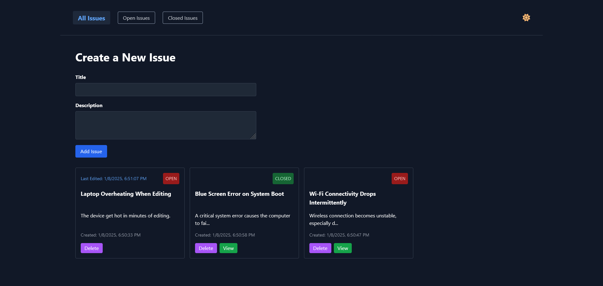
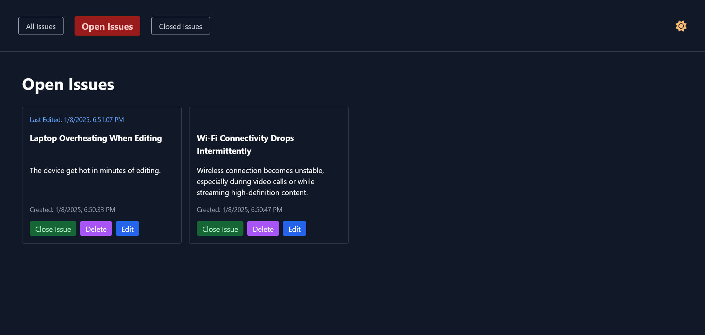
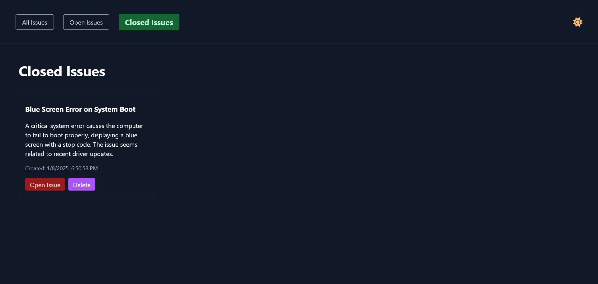

# Conditional Rendering in React

Welcome to the 3rd app of this tutorial series. In this video, we will create an Issue Tracker. The app has 3 pages, an all issues page, an open issues page and a closed issues page. We will start coding the app using Vanilla Typescript and style it with Tailwind CSS. Then we will code the app with React and implement the app routing with React Router. In the third and final iteration of the app, we will implement routing with TanStack.

## All Issues Page



## Open Issues Page



## Closed Issues Page



## Learning Objectives

By the end of this video, you will be able to:

- Learning to code a feature rich app using vanilla technologies
- Understanding the differences in approach between imperative and declarative programming
- Understanding the differences between React Router and TanStack Router.

## Issue Tracker Project Implementations

1. Vanilla Typescript - Tailwind CSS
2. React - Typescript - Tailwind CSS - React Router
3. React - Typescript - Tailwind CSS - TanStack Router

## Taking a Look at the completed projects

After forking or downloading it from GitHub, follow these steps:

1. Open with your favorite code editor

2. Install the required dependencies by running the following command:

```
npm install
```

3- Navigate to the desired directory

```
cd Issue-Tracker-Typescript
```

```
cd Issue-Tracker-React-Router
```

```
cd Issue-Tracker-React-TanStack
```

3. Start the development server by running the following command:

```
npm run dev
```

Happy Coding and Learning 😊
